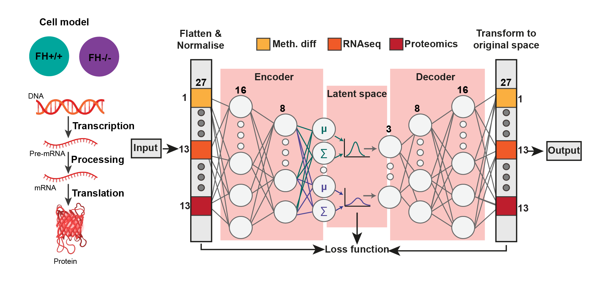
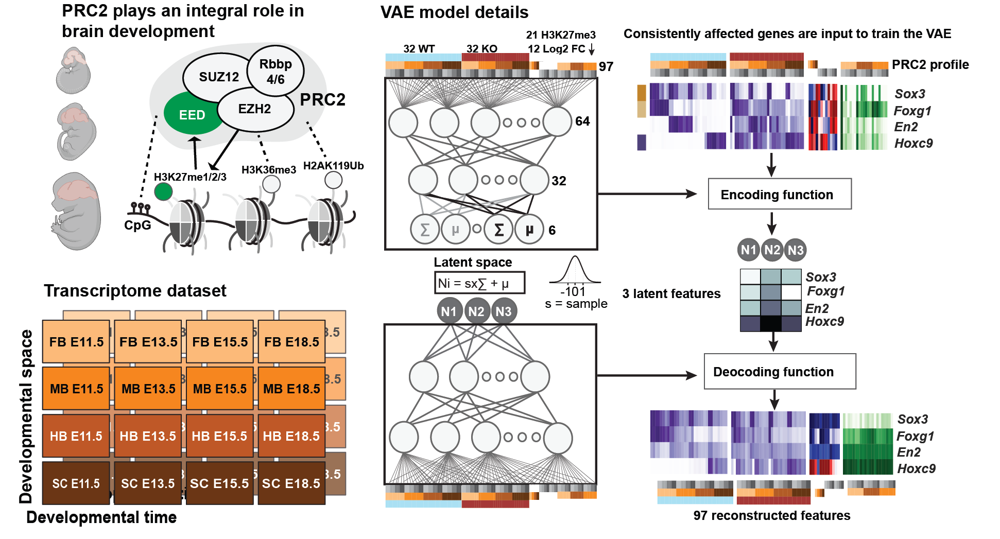
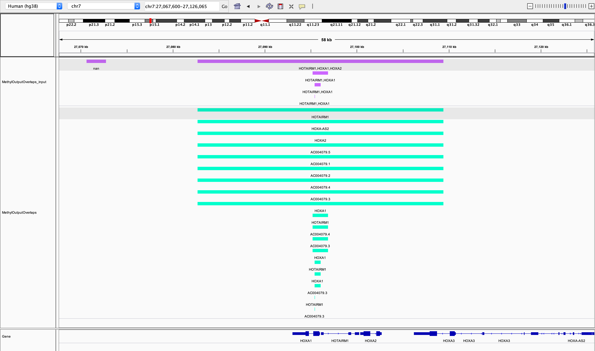

********
A. Mora
********

Academic and Work Experience
============================
**PhD Candidate** | Jul 2019 - Jul 2022 | *University of Queensland, Brisbane*
    Bioinformatics PhD developing integration methods for biological data, see *current research* and *recently developed software* below for more information.
    Supervisors: Associate Professor Mikael Boden, Professor Stefan Thor and Associate Professor Jessica Mar

**Research Assistant** | Aug 2018 - Aug 2019 | *University of Queensland - SCMB, Brisbane*
     Worked with collaborators on an ancestral sequence reconstruction tool (pipeline development and data processing). System administration tasks such as server management.

**Software Engineer** | Jan - Aug 2018 |  *intelliHR, Brisbane*
    Produced proof of concept machine learning model to predict attrition. Worked with designers to improve the user experience.

**Research Scholar** | Winter 2017 & Summer 2018 | *University of Queensland - SCMB, Brisbane*
    Developed two JavaScript visualisation tools: 1) to facilitate the analysis of epigenetic data, and 2) to investigate partial order graphs of sequence content.

**Research Technician** | Aug 2016 - Dec 2017 | *University of Melbourne - Stemformatics, Melbourne*
    Developed client side charts, completed industry based Honors developing a metabolic pathway visualisation tool (Omicxview) in collaboration with Metabolomics Australia.

**Research Attachment** | Jan - May 2016 | *GUSTO, Singapore*
    Produced open source MRI noise reduction software to quantify brown and white adipose tissue.

**Forensics Intern** | Summer 2016 | *KPMG, Brisbane*
    Used data analytics to identify fraudulent transactions.

**Electrical Engineering Intern** | Winter 2016 | *ImpediMed, San Diego*
    Benchmarked a new bioimpedence device in preparation for FDA approval.

Current Research
================

Analysing regulatory programs in FH-deficient cells
---------------------------------------------------

This project is a collaboration with Christina Schmidt from the Frezza lab. We are analysing the regulatory
programs of FH-deficient kidney cells that Christina developed during her PhD. FH is a component of the TCA cycle, with
mutations in FH leading to a specific hereditary form of kidney cancer. Given FH is integral to the metabolic process, cells
that lack FH under-go a metabolic transformation. The Frezza lab have found that epigenetic
changes such as pre- and post-translational modifications play an important role in the cellular transformation initiated by FH loss.
In order to analyse on what level genes are regulated (and by which modifications), Christina produced a number of biological assays on the FH-deficient cell-line.
Given the complexity of disentangling the regulatory programs we developed R and python based software to
analyse on which level each gene is regulated. We do this in a semi-supervised manner, coupling biological knowledge of
regulatory programs with the unbiased integrative power of variational-autoencoders. This work has been presented at Vizbi 2021 and we will
be releasing a paper soon. We are working on extending the model to publicly available data in TCGA and CPTAC. Given
our method is amenable to small datasets we are investigating the capacity of our model to determine regulatory patterns in underrepresented populations in TCGA.

Analysing the spatial and temporal regulation of PRC2 in developing mouse brains
--------------------------------------------------------------------------------

This project is a collaboration with Stefan Thor. Stefan and his lab developed a comprehensive transcriptome dataset that spans across the
anterior-posterior (A-P) developmental axis in mice. A key feature of organisms with a central nervous system, in particular those
with a distinct brain and spinal cord, is the distinctive overgrowth of the brain (the anterior region). Human's, mice,
and flies all belong to this category (bilateria), however, the amount of cells and complexity of the brain regions increases with
the complexity of the animal. How does the brain expand? How are specific cell types generated at just the right time
during development? And what distinguishes different brain regions, such as the forebrain, midbrain and hindbrain?
It is known that epigenetics (dynamic changes that can determine which genes will be expressed) plays an integral role in
controlling this system. One particular protein, PRC2, which applies an epigenetic mark (H3K27me3) that acts to repress ("turn off")
genes is of particular interest as it selectively applies H3K27me3 during development.
We seek to increase the understanding of PRC2's tissue specific control during embryonic
development by 1) developing a comprehensive transcriptome dataset of a wild-type, and also knock-out
of PRC2 (by knocking out a key gene *Eed*). Given we are testing so many different conditions there were too many pairwise
comparisons for correlation based analyses. To overcome this, we used a variational-autoencoder to build
a generative model of the PRC2 landscape for each gene. This landscape was used to understand how genes express, and are
regulated across mouse brain development. We will be releasing our paper on this soon.

Supervised projects
===================

Single Cell ATAC-seq peak reproducibility
-----------------------------------------
I am co-supervising a masters student, Wengu Pan, at the University of Queensland (completed remotely from SuZhou city, JiangSu province, China).
Wenyu's project seeks to analyse the effect of removing, or retaining low quality peaks in single cell ATAC seq data. Given
scATAC methods only capture a small proportion of peaks, is it better to retain all information, or does this leave downstream analysis methods
more susceptible to noise? Wenyu is using the rank product test to evaluate the reproducibility of peaks
across cells on a dataset of in vitro cardiac differentiation from human pluripotent stem cells from our collaborators,
Nathan Palpant and Sophie Shen.

DNA Methylation patterns across TCGA
------------------------------------
Over the summer (2020/2021) I co-supervised Anastassia Demeshko, a masters student in public health, on her project to analyse method bias when assigning DNA methylation
changes to genes. Generally, it is reported that DNA-methylation, when found in the promoter of a gene, causes the nearby gene to be repressed.
However, does the data actually fit this hypothesis? When does this stand true, and when does this break down?
Given there is no gold-standard method for assigning DNA-methylation changes to genes we
use the standard approach of assigning CpG methylation values to genes if they fell within a distance from the TSS of a gene.
Anastasia found that how we assign DNA methylation changes to genes drastically affects the results of a study and
the assumed regulatory programs governed by DNA methylation. Anastassia's work also examined summary statistics and found that
using the median value of DNA-methylation was less susceptible to bias that using the maximum change in DNA methylation.

During this period I also co-supervised Alice Schulz, an undergraduate statistics/genetics student, on her project
which aimed to define and identify a methylation tendency score. Here we asked, are there specific regions of the genome
which are more likely to be affected in tumours as compared with normal tissue. We also sought to investigate which
regions had the biggest effect on the expresion of near-by genes. Alice first found distinct patterns of DNA-methlylation
unique to each tumour type, and then found that by taking into account the proportions
of changes in different regions of methylation (CpG islands vs UTR's) a more robust methylation
tendency score as produced.

Recently developed software
===========================

sci-vae
-------
Sci-VAE is an implementation of a variational autoencoder (VAE) in Keras that I developed to use VAEs to integrate
biological data. The implementation allows for customisations to the VAE to be passed in via CLI (and a JSON file) or
in python and R scripts (see examples).

The VAE implementation expects a data matrix with features as columns (no headers) and rows as training data (no row IDs).
The first thing the VAE will do is transform your data between 0 and 1 so you don't need to do this prior to running the
VAE.

I show several examples, using MNIST, IRIS dataset and then also a publicly available histone modification and RNAseq
dataset from encode (for those bioinformaticians out there). There are also some useful visualisations that I was having to repeat often when inspecting the latent space so check
out the Vis functions if you're interested (these are also in the examples).

Lastly, there is a optimisation library that allows you to optimise the VAE architecture based on building a separable
latent space based on classification. If you choose to use this you'll also need to pass in *labels* into the VAE. Check
out some tests for how to run this - it uses an evolutionary algorithm. Code will be released soon (with the papers above).

sci-diffMethGenes
-----------------

Sci-dmg aims to assign a change in DNA methylation (as calculated by an external tool) to genes in a consistent and unbiased manner.
The user provides a DMR file, a file with the percentage of DNA Methylation, and also the DMCs. Using these, sci-DMG
consolidates the DMR's and DMC's that are consistent. DMR regions (significant q <= 0.1) with at least 60% of DMCs
(q < 0.1) agreeing with the DMR change in methylation direction were kept.
Genes with multiple DMRs were removed if the DMRs were not in agreement (meth. Diff. direction).
If the DMRs were in agreement, the CpG with the highest DNA methylation difference in the direction of change is
assigned as the methylation value (change and padj) for that gene i.e. as the driver CpG behind the gene’s change in
DNA methylation. Note the cutoff values are all adjustable. Future works includes assigning not only based on promoter
but also on methylation assigned in UTR, on exons, etc.

Any tool can be used to produce the DMC's and DMR's, two such tools are
`MethylKit <https://bioconductor.org/packages/release/bioc/html/methylKit.html>`_ and
`MethylSig <https://pubmed.ncbi.nlm.nih.gov/24836530/>`_ many others exist.

sci-epi2gene
------------

`Sci-epi2gene <https://github.com/ArianeMora/sciepi2gene/>`_  maps events annotated to a genome location to nearby genes - i.e. peaks from histone modification data
ChIP-seq experiemnts stored as bed data, or DNA methylation data in csv format (e.g. output from DMRseq or methylKit).

The user provides a SORTED gene annotation file with start, end, and direction for each gene (we recommend using
`sci-biomart <https://github.com/ArianeMora/scibiomart>`_.

The user then selects how to annotate, i.e. whether it is in the promoter region, or overlaps the gene body. Finally,
the parameters for overlap on each side are chosen. This algorithm only runs through the file once, so should have
computational complexity of O(N).

It is available under the `GNU General Public License (Version 3) <https://www.gnu.org/licenses/gpl-3.0.en.html>`_.

This package is a wrapper that allows various epigenetic data types to be annotated to genes. I also wanted to have different upper flanking and lower flanking distances that took into account the directionality of the strand
and also an easy output csv file that can be filtered and used in downstream analyses. This is why I keep all features
that fall within the annotation region of a gene (example below):

The overlapping methods are as follows:
    1) Overlaps: this means does ANY part of the peak/feature overlap the gene body + some buffer before the TSS and some buffer on the non-TSS side
    2) Promoter: does ANY part of the peak/feature overlap with the TSS of the gene taking into account buffers on either side of the TSS.

As you can see from the above screenshot using IGV, the input peaks are in purple, and the output
peaks as annotated to genes are in green. The function *convert_to_bed* converts the output csv to bed files for viewing. This example
shows that a peak/feature can be annotated to multiple genes. Peaks/features outside of the regions of genes (e.g.
the first peak) are dropped from the output.

We show this example in the :ref:`notebook <examples/notebook>`, where we use `IGV <https://github.com/igvteam/igv-jupyter#igvjs-jupyter-extension>`_
to view the tracks (see image below).

.. figure:: _static/igv_jupyter.png

Lastly, there are sometimes differences between annotations (i.e. the TSS on your annotation in IGV may differ to the
annotation you input to sciepi2gene), naturally, how your genes/features are annotated depends on the input file so if you see differences check this first!

Please post questions and issues related to sci-epi2gene on the `Issues <https://github.com/ArianeMora/sciepi2gene/issues>`_  section of the GitHub repository.

sci-downloadAnnotateTCGA
------------------------

`Sci-Download-Annotate-TCGA <https://github.com/ArianeMora/scidat/>`_ is a wrapper around the functions provided by
TCGA and the `GDC data portal <https://portal.gdc.cancer.gov/>`_.
Long story short, I was needing to merge many of the data (RNAseq and DNA methylation) together from TCGA and I wanted
to keep track of the demographics of the patients to ensure I had a balanced dataset. I also wanted to easily find
genes in groups of patients with mutations. I found no easy ways to do these things, so I made this wrapper to be able to:

1) Create a dataframe of many RNAseq datasets from TCGA (and automatically download these)
2) Merge RNAseq and DNA methylation datasets so for each gene I could see a cross mode profile
3) Annotate each experiment with demographic information
4) Anotate each gene with mutation information and search for genes with specific mutations through the API.

This package provides the above in `python notebooks`, `R markdown`, and a `CLI`.

It is available under the `GNU General Public License (Version 3) <https://www.gnu.org/licenses/gpl-3.0.en.html>`_.

Please post questions and issues related to sci-dat on the
`Issues <https://github.com/ArianeMora/scidat/issues>`_  section of the GitHub repository.

sci-motf
--------

`sci-moTF <https://github.com/ArianeMora/scimotf>`_ is a simple package to help with finding motifs that are enriched in different clusters,
that are also expressed in your dataset and make it easier to draw inferences on which TFs may be driving
the observed changes.

The input to sci-motf is: 1) the output of FIMO , fimo.tsv, 2) a CSV file with gene identifier (e.g. name), cluster, log2FC, and p-value.

sci-biomart
-----------

`Sci-biomart <https://github.com/ArianeMora/scibiomart/>`_ is a simple wrapper around the API from BioMart, but I found existing packages were not quite sufficent
for what I was wanting to do. The handy thing about this is that most queries can be performed in a single line, and
you can also use it for running in a pipeline (since it supports CLI).

Here you can simply get the list of all genes and perform other biomart functions such as mapping between human and
mouse.

It is available under the `GNU General Public License (Version 3) <https://www.gnu.org/licenses/gpl-3.0.en.html>`_.

Please post questions and issues related to sci-loc2gene on the
`Issues <https://github.com/ArianeMora/scibiomart/issues>`_  section of the GitHub repository.

sci-RNAprocessing
-----------------

Scirnap (sci-RNAprocessing) is a wrapper for some commonly used programs for processing RNAseq data. I created this wrapper to make pipelines
more reproducible while keeping things completely modular and allowing for any other program to be added.
The main thing I like is that there are consistent log files output and the direct path to a program can be passed
(I've found this useful on shared servers.) It has made it super easy for me to reproduce pipelines while not
adding overhead. Code will be released soon mid 2021.

sci-viso
--------

`Sci-viso <https://github.com/ArianeMora/sciviso/>`_ is a visualisation package that I use for all my scientific visualisations. It uses charts from matplotlib and seaborn,
but then adds styles for papers (for example, size 6 bold arial font). Colour palletes are inbuilt as is statistics on
boxplots.

sci-util
--------

`Sci-util <https://github.com/ArianeMora/sciviso/>`_ has Utility functions for my sci* packages. This package contains utility functions such as error catching and handling,
and logging functions.

Previous projects
=================

Graphical Representation of Ancestral Sequence Prediction
----------------------------------------------------------

`GRASP <https://bodenlab.github.io/GRASP-suite/publication/grasp/>`_ enables users to perform ancestral sequence prediction
and visualisation via a `web-interface <grasp.scmb.uq.edu.au/guide>`_. My role consisted largely of developing the web,
and backend architecture to support the web tool and the implementation of the optimal path finding algorithm through
the POAG.

"We developed Graphical Representation of Ancestral Sequence Predictions (GRASP) to infer and explore
ancestral variants of protein families with more than 10,000 members. GRASP uses partial order graphs to
represent homology in very large datasets, which are intractable with current inference tools and may, for
example, be used to engineer proteins by identifying ancient variants of enzymes. We demonstrate that (1)
across three distinct enzyme families, GRASP predicts ancestor sequences, all of which demonstrate enzymatic
activity, (2) within-family insertions and deletions can be used as building blocks to support the engineering of
biologically active ancestors via a new source of ancestral variation, and (3) generous inclusion of sequence data
encompassing great diversity leads to less variance in ancestor sequence." from the
`documentation <https://bodenlab.github.io/GRASP-suite/publication/grasp/>`_

Authors: Gabriel Foley, Ariane Mora, Connie M Ross, Scott Bottoms, Leander Sutzl, Marnie L Lamprecht, Julian Zaugg,
Alexandra Essebier, Brad Balderson, Rhys Newell, Raine ES Thomson, Bostjan Kobe, Ross T Barnard, Luke Guddat,
Gerhard Schenk, Joerg Carsten, Yosephine Gumulya, Burkhard Rost, Dietmar Haltrich, Volker Sieber, Elizabeth MJ Gillam, Mikael Boden

- `GRASP <https://www.biorxiv.org/content/10.1101/2019.12.30.891457v2>`_  preprint

OmixView
--------

Abstract: Omicxview is an interactive visualisation portal that enables researchers to display large metabolic datasets
on well-defined Escher pathways. It addresses the gap between very simple static views, such as the common approach of
colouring KEGG pathways, and the comprehensive networks such as Reactome, which can be so complex that the signal of interest is dwarfed by background information.
Omicxview overlays experimental data onto metabolic pathways, providing users with
intuitive ways to explore large multi-omic datasets. Authors: Ariane Mora, Rowland Mosbergen, Steve Englart, Othmar Korn, Mikael Boden and Christine A Wells.

- Oral Presentation at E-Research Australasia, (Oct 2017)
- Oral Presentation at Joining the Dots Symposium (Aug 2017)

Footnote
--------
*Figures contain images generated using BioRender.*